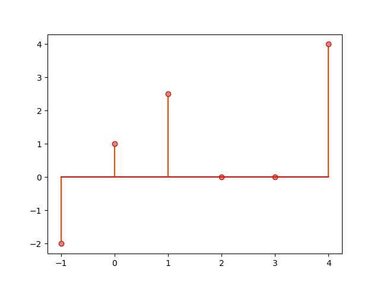
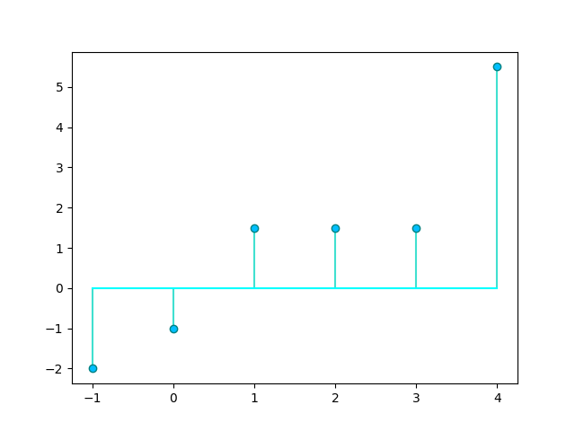

# DiscreteTimeLib

**DiscreteTimeLib** is a Python library for the analysis of discrete-time signals and systems. See [documentation](https://alvii147.github.io/DiscreteTimeLib/docs/build/html/index.html) for more information.

## Overview

The `DiscreteTimeSignal` class can be used to model a discrete-time signal:

```python
>>> from DiscreteTimeLib import DiscreteTimeSignal
>>> import matplotlib.pyplot as plt
```

```python
>>> data = ((-3, -2.2), (-2, -1), (-1, 1.5), (0, 2), (1, 3.3), (2, 5), (5, 12))
>>> x_n = DiscreteTimeSignal(data)
>>> print(x_n)
    x[n]
-3  -2.2
-2  -1.0
-1   1.5
 0   2.0
 1   3.3
 2   5.0
 5  12.0
```

```python
>>> markerline, stemlines, baseline = plt.stem(x_n.keys(), x_n.values())
>>> plt.setp(markerline, 'markerfacecolor', 'salmon')
>>> plt.setp(markerline, 'markeredgecolor', 'firebrick')
>>> plt.setp(stemlines, 'color', 'orangered')
>>> plt.setp(baseline, 'color', 'red')
>>> plt.show()
```



`DiscreteTimeSignal` supports various operations, including **convolution**:

```python
>>> data = ((-1, 2), (0, 2.5), (1, 2.1))
>>> y_n = DiscreteTimeSignal(data)
>>> conv = x_n * y_n
>>> print(conv)
     x[n]
-4  -4.40
-3  -7.50
-2  -4.12
-1   5.65
 0  14.75
 1  22.45
 2  19.43
 3  10.50
 4  24.00
 5  30.00
 6  25.20
```

```python
>>> markerline, stemlines, baseline = plt.stem(conv.keys(), conv.values())
>>> plt.setp(markerline, 'markerfacecolor', 'salmon')
>>> plt.setp(markerline, 'markeredgecolor', 'firebrick')
>>> plt.setp(stemlines, 'color', 'orangered')
>>> plt.setp(baseline, 'color', 'red')
>>> plt.show()
```


The `DiscreteTimeSystem` class can be used to model a discrete-time system and apply the system filter on a signal:

```python
>>> from DiscreteTimeLib import DiscreteTimeSystem
```

```python
>>> H = DiscreteTimeSystem([1], [1, -1])
>>> y_n = H.filter(x_n)
>>> print(y_n)
    x[n]
-3  -2.2
-2  -3.2
-1  -1.7
 0   0.3
 1   3.6
 2   8.6
 3   8.6
 4   8.6
 5  20.6
```

```python
>>> markerline, stemlines, baseline = plt.stem(y_n.keys(), y_n.values())
>>> plt.setp(markerline, 'markerfacecolor', 'salmon')
>>> plt.setp(markerline, 'markeredgecolor', 'firebrick')
>>> plt.setp(stemlines, 'color', 'orangered')
>>> plt.setp(baseline, 'color', 'red')
>>> plt.show()
```



## Installation

Clone the repository:

```
git clone https://github.com/alvii147/DiscreteTimeLib.git
```

Install dependencies:

```
cd DiscreteTimeLib/
pip3 install -r requirements.txt
```
