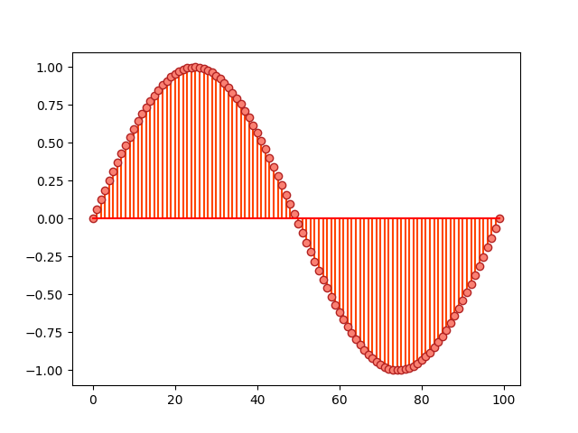
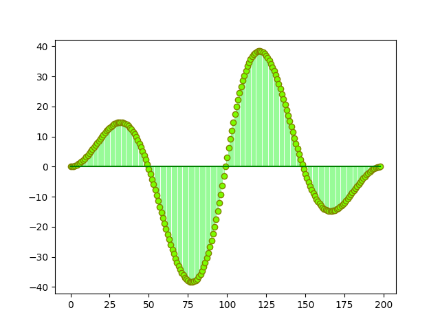
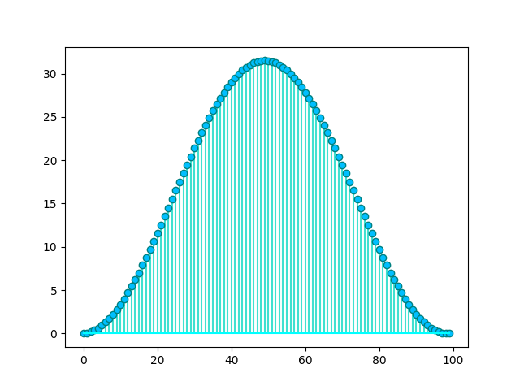

# DiscreteTimeLib

**DiscreteTimeLib** is a Python library for the analysis of discrete-time signals and systems. See [documentation](https://alvii147.github.io/DiscreteTimeLib/build/html/index.html) for more information.

## Overview

### Discrete-Time Signals

The `DiscreteTimeSignal` class can be used to model a discrete-time signal:

```python
>>> from DiscreteTimeLib import DiscreteTimeSignal
>>> import numpy as np
>>> import matplotlib.pyplot as plt
```

```python
>>> data = [
...     (n, np.sin(x)) for n, x in enumerate(np.linspace(0, 2 * np.pi, num=100))
... ]
>>> x_n = DiscreteTimeSignal(data)
>>> print(x_n)
            x[n]
0   0.000000e+00
1   6.342392e-02
2   1.265925e-01
3   1.892512e-01
4   2.511480e-01
..           ...
95 -2.511480e-01
96 -1.892512e-01
97 -1.265925e-01
98 -6.342392e-02
99 -2.449294e-16

[100 rows x 1 columns]
```

```python
>>> markerline, stemlines, baseline = plt.stem(x_n.keys(), x_n.values())
>>> plt.setp(markerline, 'markerfacecolor', 'salmon')
>>> plt.setp(markerline, 'markeredgecolor', 'firebrick')
>>> plt.setp(stemlines, 'color', 'orangered')
>>> plt.setp(baseline, 'color', 'red')
>>> plt.show()
```



### Convolution

`DiscreteTimeSignal` supports various operations, including **convolution**:

```python
>>> data = [
...     (n, np.cos(x)) for n, x in enumerate(np.linspace(0, 2 * np.pi, num=100))
... ]
>>> h_n = DiscreteTimeSignal(data)
>>> y_n = h_n * x_n
>>> print(y_n)
             x[n]
0    0.000000e+00
1    6.342392e-02
2    1.898887e-01
3    3.785025e-01
4    6.278700e-01
..            ...
194 -6.278700e-01
195 -3.785025e-01
196 -1.898887e-01
197 -6.342392e-02
198 -2.449294e-16

[199 rows x 1 columns]
```

```python
>>> markerline, stemlines, baseline = plt.stem(y_n.keys(), y_n.values())
>>> plt.setp(markerline, 'markerfacecolor', 'lawngreen')
>>> plt.setp(markerline, 'markeredgecolor', 'olive')
>>> plt.setp(stemlines, 'color', 'palegreen')
>>> plt.setp(baseline, 'color', 'green')
>>> plt.show()
```



### Filtering

The `DiscreteTimeSystem` class can be used to model a discrete-time system and apply the system filter on a signal:

```python
>>> from DiscreteTimeLib import DiscreteTimeSystem
```

```python
>>> b = (1,)
>>> a = (1, -1)
>>> H = DiscreteTimeSystem(b, a)
>>> y_n = H.filter(x_n)
>>> print(y_n)
            x[n]
0   0.000000e+00
1   6.342392e-02
2   1.900164e-01
3   3.792676e-01
4   6.304156e-01
..           ...
95  3.792676e-01
96  1.900164e-01
97  6.342392e-02
98  1.665335e-15
99  1.420405e-15

[100 rows x 1 columns]
```

```python
>>> markerline, stemlines, baseline = plt.stem(y_n.keys(), y_n.values())
>>> plt.setp(markerline, 'markerfacecolor', 'deepskyblue')
>>> plt.setp(markerline, 'markeredgecolor', 'teal')
>>> plt.setp(stemlines, 'color', 'turquoise')
>>> plt.setp(baseline, 'color', 'cyan')
>>> plt.show()
```



### Inverse z-transforms

The `DiscreteTimeSystem` class can also compute the **inverse z-transform** in the form of a [Sympy](https://www.sympy.org/) expression:

```python
>>> h_n, n = H.iztrans()
>>> print(h_n)
1.0*Heaviside(n, 1)
```

## Installation

Clone the repository:

```
git clone https://github.com/alvii147/DiscreteTimeLib.git
```

Install dependencies:

```
cd DiscreteTimeLib/
pip3 install -r requirements.txt
```
