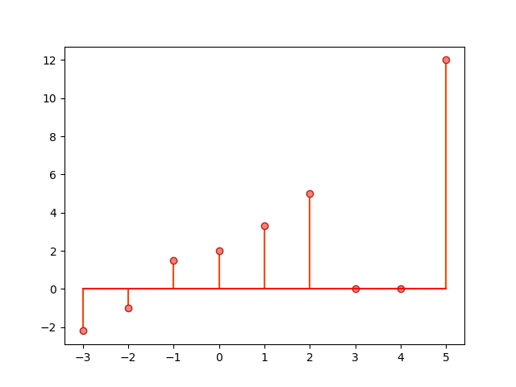
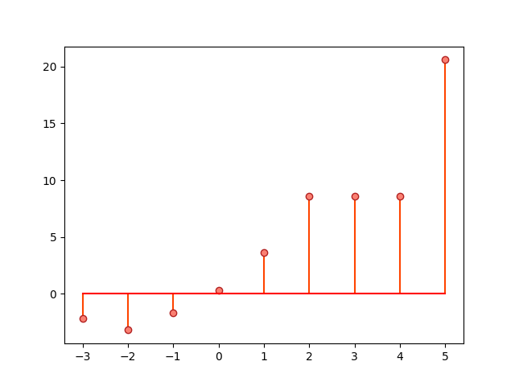

# DiscreteTimeLib

**DiscreteTimeLib** is a Python library for the analysis of discrete-time signals and systems.

## Overview

The `DiscreteTimeSignal` class can be used to model a discrete-time signal:

```python
from DiscreteTimeLib import DiscreteTimeSignal
import matplotlib.pyplot as plt

if __name__ == '__main__':
    data = (
        (-3, -2.2),
        (-2, -1),
        (-1, 1.5),
        (0, 2),
        (1, 3.3),
        (2, 5),
        (5, 12),
    )
    sig = DiscreteTimeSignal(data)

    print(sig)

    markerline, stemlines, baseline = plt.stem(sig.keys(), sig.values())
    plt.setp(markerline, 'markerfacecolor', 'salmon')
    plt.setp(markerline, 'markeredgecolor', 'firebrick')
    plt.setp(stemlines, 'color', 'orangered')
    plt.setp(baseline, 'color', 'red')
    plt.show()
```

```
    x[n]
-3  -2.2
-2  -1.0
-1   1.5
 0   2.0
 1   3.3
 2   5.0
 5  12.0
```



The `DiscreteTimeSystem` class can be used to model a discrete-time system and apply the system filter on a signal:

```python
from DiscreteTimeLib import DiscreteTimeSignal, DiscreteTimeSystem
import matplotlib.pyplot as plt

if __name__ == '__main__':
    data = (
        (-3, -2.2),
        (-2, -1),
        (-1, 1.5),
        (0, 2),
        (1, 3.3),
        (2, 5),
        (5, 12),
    )
    sig = DiscreteTimeSignal(data)

    H = DiscreteTimeSystem([1], [1, -1])
    filtered_sig = H.filter(sig)

    print(filtered_sig)

    markerline, stemlines, baseline = plt.stem(
        filtered_sig.keys(),
        filtered_sig.values(),
    )
    plt.setp(markerline, 'markerfacecolor', 'salmon')
    plt.setp(markerline, 'markeredgecolor', 'firebrick')
    plt.setp(stemlines, 'color', 'orangered')
    plt.setp(baseline, 'color', 'red')
    plt.show()
```

```
    x[n]
-3  -2.2
-2  -3.2
-1  -1.7
 0   0.3
 1   3.6
 2   8.6
 3   8.6
 4   8.6
 5  20.6
```



## Installation

Clone the repository:

```
git clone https://github.com/alvii147/DiscreteTimeLib.git
```

Install dependencies:

```
cd DiscreteTimeLib/
pip3 install -r requirements.txt
```
